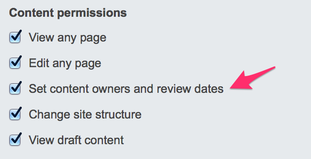
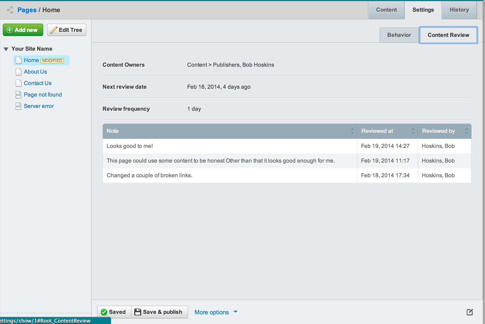

# Content Review module

This module helps keep your website content accurate and up-to-date, which keeps your users happy. 

It does so by sending reviewers reminder emails to go in and check the content. For a reviewer this 
often includes checking links, grammar, factual information and look and feel.

There are two types of roles with this module. 

 * Website owner; (typically assigned to the Administrator group) ensures that a website is accurate and up-to-date, by delegating responsibility to content reviewers.
 * Content reviewer; responsible for keeping a website or part of a website accurate and up-to-date.

## Features

 * Content reviewer will receive an email notification when a page is due for review. 
 * Content reviewer can mark a page as 'reviewed', and provide review notes.
 * Website owner can assign content reviewers to a page and set when the content should be reviewed.
 * Website owner can see a report of pages and their reviewed status.
 * Content reviewers can be assigned to a page, a page and all sub-pages, or globally.
 * The content review schedule can be automatic, e.g. every month, and/or a specific date. 

## Wishlist features:

 * Overdue review reminder emails.
 * Customisable reminder emails.

## Requirements

 * SilverStripe Framework and CMS

## Composer installation

	composer require silverstripe/contentreview

## Manual installation

Download or clone the source code into the SilverStripe root folder. Rename the module folder
to `contentreview`.

Run dev/build either via the webserver by opening the url `http://<your-host>/dev/build` or 
by running the dev/build via a CLI.

## Configuration

In order for the contentreview module to send emails, you need to *either*:

 * Setup the DailyTask script to run daily via cron. See framework/tasks/ScheduledTask.php for more information on setup.
 * Install the queuedjobs module, and follow the configuration steps to create a cron job for that module. Once installed, you can just run dev/build to have a job created, which will run at 9am every day by default.

## Usage

To set up content review schedules you need to log in as a user with the 'Set content owners and review dates' permission. This can either 
be an administrator who has all permissions, or by giving a group the specific permission. 

To set a content review schedule for a page go to `Settings > Content Review`.

CMS users without the permission to change the content review schedule can still see the settings 
and previous reviews in the same view, but cannot change anything.

## Testing

cd to the site root, and run 
	php vendor/bin/behat

or to test this module when used on a website
	php vendor/bin/behat contentreview/tests

## Migration

 * If you are upgrading from an older version, you may need to run the ContentReviewOwnerMigrationTask
