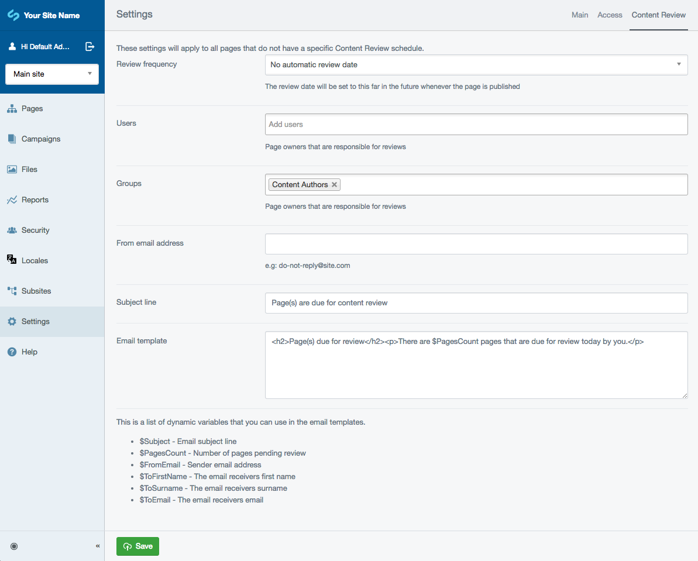
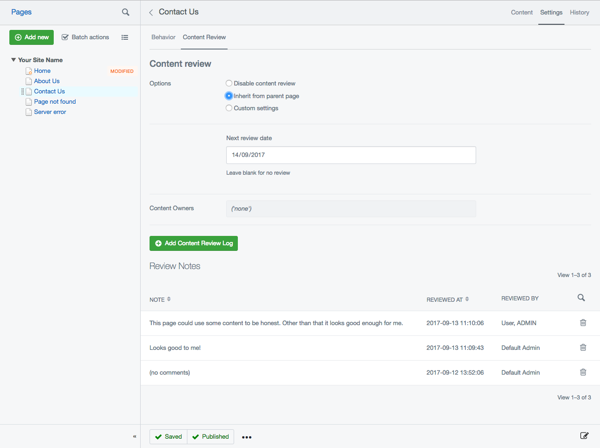
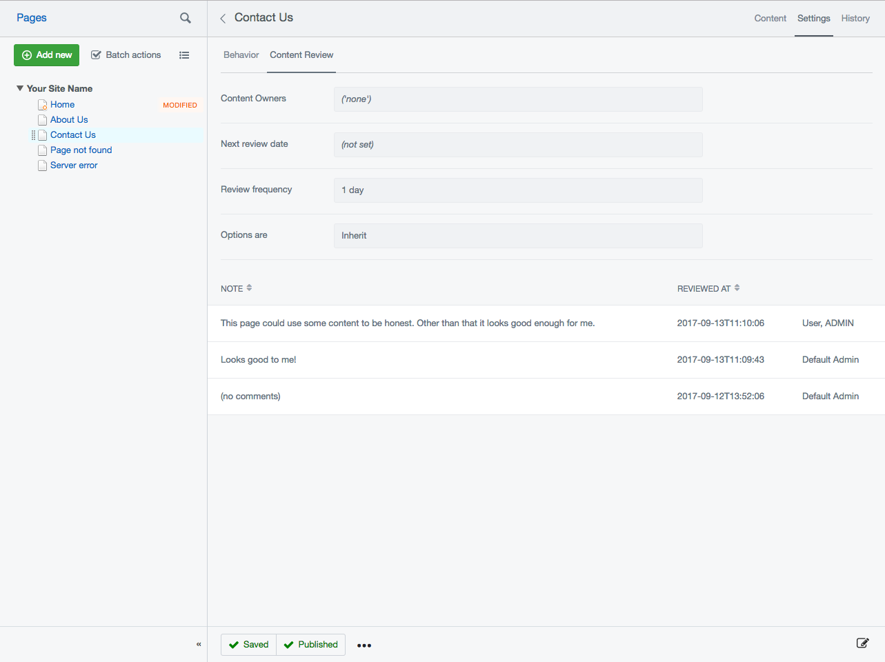

## Content review

## Setting up

Global settings can be configured via the global settings admin in the CMS under the "Content Review" tab.
This includes global groups, users, as well as a template editor that supports a limited number of variables.

## Schedules

To set up content review schedules you need to log in as a user with the 'Set content owners and review dates' permission. This can either
be an administrator who has all permissions, or by giving a group the specific permission.

To set a content review schedule for a page go to `Settings > Content Review`.

CMS users without the permission to change the content review schedule can still see the settings
and previous reviews in the same view, but cannot change anything.

